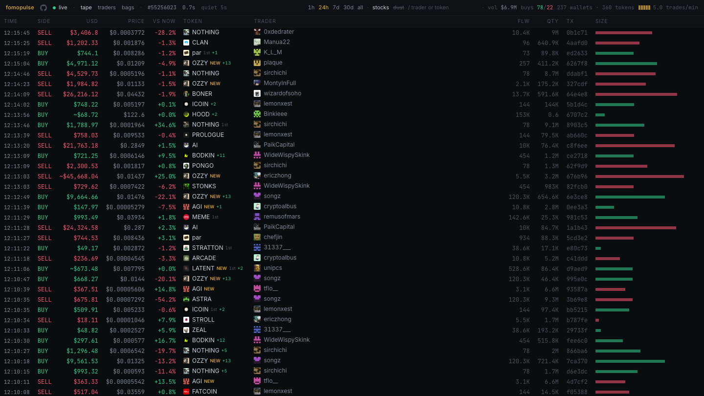

# fomopulse

[](https://github.com/itsnex1s/fomopulse-robinhood-chain-tape/actions/workflows/ci.yml)
[](https://fomopulse.app)

**Live demo: [fomopulse.app](https://fomopulse.app)**

A live tape of what the top fomo.family traders buy and sell on Robinhood Chain: every
fill, priced, about a second after it lands. Same idea as robinhoodtrenches.com, rebuilt so
anyone can run it — adding a wallet or a chain is a pull request, not a code change.

Read-only. It holds no keys, signs nothing, and none of it is advice.

[](https://fomopulse.app)

## Run it

```bash
bun install
bun run build                        # the web app into apps/web/dist
bun run ingest --once --tail 3000    # ~5 minutes of real fills, public RPC, no account anywhere
bun run ingest                       # catch up, serve http://localhost:8080, follow the chain live
```

Live mode follows PublicNode's public socket by default; set `RPC_WS_URL` for your
own endpoint, or `bun run ingest --poll 12` to re-read the chain every 12 seconds instead.

| in `.env` | what it is |
|---|---|
| `RPC_WS_URL` | websocket endpoint for live mode; defaults to PublicNode's public socket |
| `RPC_HTTP_URL` | endpoint for catch-up and receipts; defaults to the chain's public RPC, with wide log scans falling back to a second public endpoint when the first refuses the range |
| `FOMO_ACCESS_TOKEN` | a fomo session, only for the PnL, avatars and positions fomo publishes; the tape runs without it |
| `FOMO_PRIVY_PAT`, `FOMO_REFRESH_TOKEN` | the rest of that session, from the same browser; with them it renews itself instead of expiring in an hour |

## Deploy

One Cloudflare Worker at the edge, one Durable Object holding the tape, the built web app
as static assets. Live at [fomopulse.app](https://fomopulse.app); `routes` in
`apps/worker/wrangler.jsonc` names that domain, so point it at your own or drop it and take
the `workers.dev` address instead.

```bash
cd apps/worker
bunx wrangler secret put RPC_WS_URL          # optional: your own subscription
bunx wrangler secret put RPC_HTTP_URL        # https://… receipts and catch-up
bunx wrangler secret put FOMO_ACCESS_TOKEN   # optional: PnL, avatars, positions
bunx wrangler secret put FOMO_PRIVY_PAT      # …and the two that keep it alive
bunx wrangler secret put FOMO_REFRESH_TOKEN
cd ../.. && bun run cf:deploy
```

`bun run cf:dev` runs that same stack on your machine, with the secrets in
`apps/worker/.dev.vars`. The `Dockerfile` builds the single-process version for anywhere else:

```bash
docker build -t fomopulse .
docker run -p 8080:8080 -v fomopulse-data:/data -e RPC_WS_URL=wss://... fomopulse
```

## What it serves

| | |
|---|---|
| `GET /api/status` | chain, wallets, block, source, latency, lag, uptime |
| `GET /api/tape?window=&limit=&stocks=&dust=&before=&beforeId=` | the tape in the shape robinhoodtrenches.com serves, plus the token's card from the feed and fomo's standing for the trader. `before`/`beforeId` are the time and id of a row already held, and answer with the page before it |
| `GET /api/overview?window=` | the window in a line: volume, buys and sells, wallets, tokens, pace, the biggest buy |
| `GET /api/traders?window=&limit=` | every tracked wallet: what it did here, and fomo's numbers about it |
| `GET /api/bags?window=&limit=` | what the tracked traders are sitting in, by token: positions and profit, the feed's quote, the tape's flow |
| `WS /ws` | `{type:"fills", data:[…]}` as they land |
| `GET /api/alive` | the fomo session — deployed, renewing, when it expires — and the uptime; on Cloudflare also what the pulse last did: which step, how long it took, what failed |

## What you see

Three screens, `[` and `]` between them. **tape** is the fills as they land; **traders** is
every tracked wallet with what it did here and where fomo ranks it; **bags** is what those
wallets are holding, by token, with a button per chain fomo reports a position on.

`1`–`5` pick the window every screen counts in, `t` shows or hides tokenised stocks, `d`
the dusting — tokens nobody paid for, pushed to every tracked wallet — and `/` filters by
trader or token. A phone has no hover, so a tap opens the token and trader cards under the
row.

The one column worth naming: **vs now** is the trade against the token's price now, not the
token's own move. A buy is green when the token trades higher than it was bought at, a sell
when it trades lower than it was sold at — so a large sell that moved the price is usually
green, because it sold above where the token trades after it. The token's own move is `1h`
and `24h` on its card.

The bar across the top counts the window: `vol` is what the tracked wallets traded, `buys`
is the share of fills that were buys against sells, then how many wallets traded how many
tokens, and the pace in trades a minute.

The tape holds the last four hundred fills, which at this pace is about half an hour — the
counters above it still cover the whole window, so **older** at the foot of the table asks
for the page before the oldest row and keeps going. What the database itself keeps is
longer and finite: fills for ninety days, the receipts they were derived from for fourteen,
and a snapshot of every bag for ninety. Nothing pruned any of it before 2026-09-05, when
the store was growing 62 MB a day and the object's SQLite stops at ten gigabytes.

Two things are deliberately not trades. A quote from a pool with less than $1 000 in it is
not a price — an almost-empty pool prices whatever dust last crossed it, and on 2026-09-06
one of them had the tape reporting $132.9 billion of volume in a day — so those tokens are
left unpriced, which the tape shows as a dash. And the same amount, from one sender, to
five wallets or more in a single transaction is a handout however much the pool says it is
worth: nobody buys the identical quantity as seventy other people at the same instant.
A token that turns out to trade for real pardons its own dusting — one paid buy brings its
whole cheap history back — but never a handout: fomocat has a live pool, fifteen honest
buys in it, and a spray to seventy-three wallets at a time, and the three are separate
facts. Both rules are why the receipts are kept. `bun run rebuild` replays them through the
current reconstruction without touching the chain, and a deployment whose rules have moved
on replays its own once, a couple of thousand receipts per pass, on the next few ticks.

Fills, volume and share are measured here. PnL, rank, avatars and positions are fomo's
own numbers, stored as published — those need `FOMO_ACCESS_TOKEN`, a read-only Privy
session from a logged-in browser, which lives for an hour and renews itself for as long
as Privy keeps the session behind `FOMO_REFRESH_TOKEN`. That session is your own account's,
it reads what your own login already sees, and it is yours to keep within fomo.family's
terms — the leaderboard is asked for once every ten minutes, and nothing here logs in for
you, holds anyone else's session, or writes anything back. Tracked wallets live in
[config/wallets.json](config/wallets.json), the chain in
[config/chains/robinhood.json](config/chains/robinhood.json), and the service those
numbers come from — its API, its site, the public identifiers of its Privy app — in
[config/fomo.json](config/fomo.json).

## Contributing

`bun run check` runs what CI runs. [CONTRIBUTING.md](CONTRIBUTING.md) covers the layout
and how to add a wallet, a chain, or a mispriced fill. How to be around here is
[CODE_OF_CONDUCT.md](CODE_OF_CONDUCT.md); security reports go through
[SECURITY.md](SECURITY.md).

Not affiliated with fomo.family, Robinhood, or robinhoodtrenches.com. Wallet addresses,
handles and follower counts in this repository come from public profiles and a public
chain. If one of them is yours and you would rather not be listed, open an issue saying
so — the entry comes out, no reason needed, and the tape carries on without it.

## License

[MIT](LICENSE).
